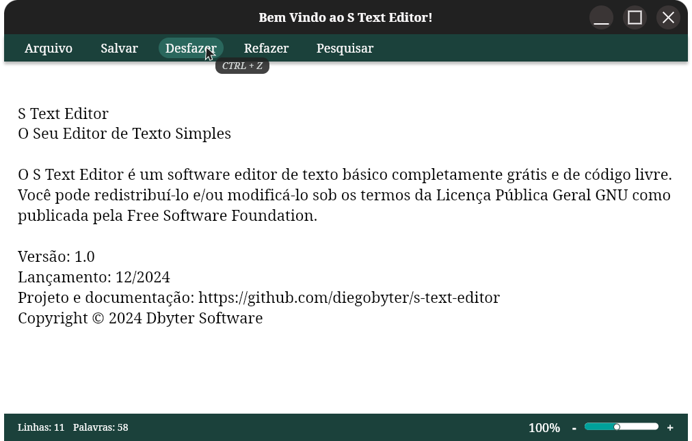
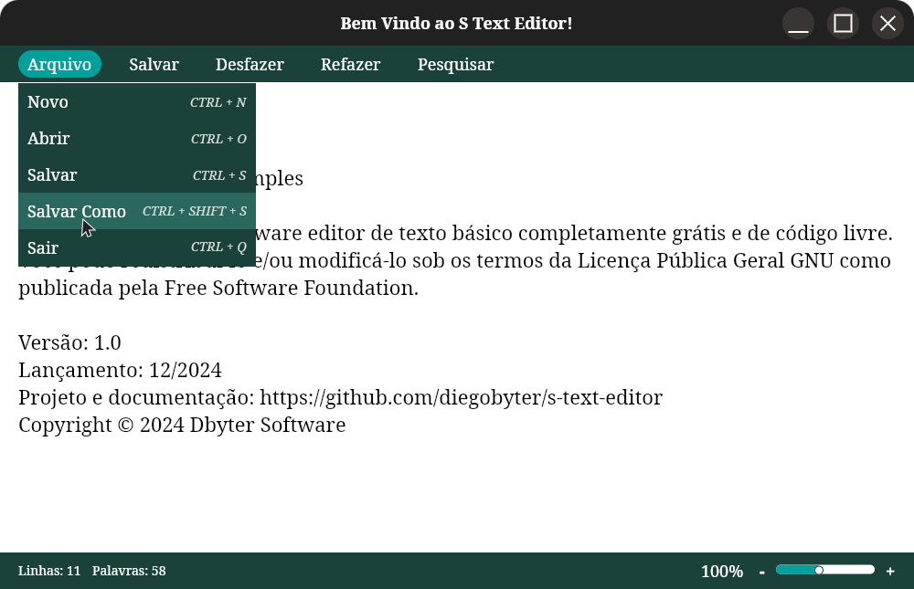
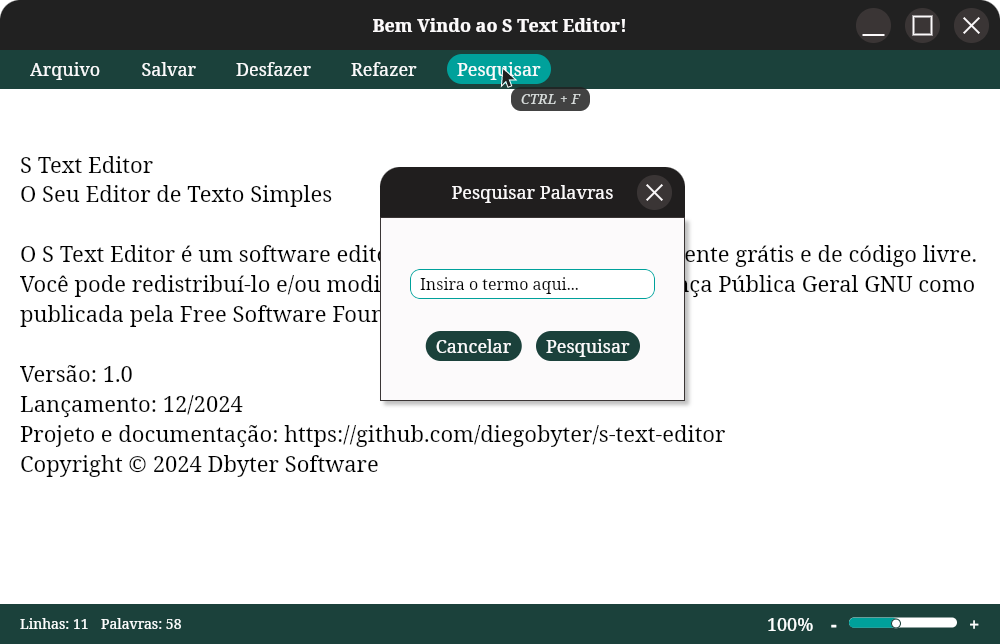
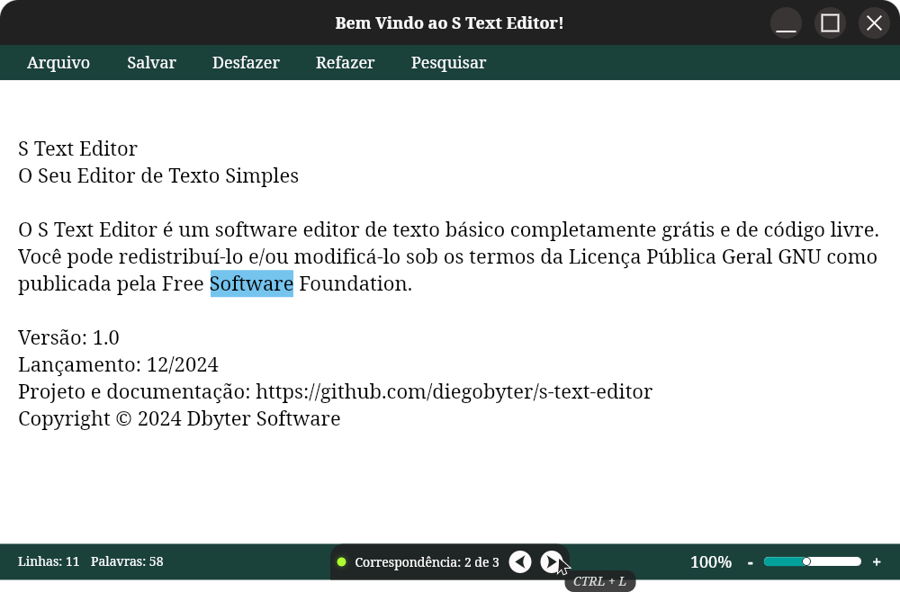

# **Design Document**

## Índice
1. [Introdução](#introducao)
2. [Introdução](#2.-estrutura-de-design)
   - [Paleta de Cores](#2.1.-paleta-de-cores)
   - [Estrutura da Interface](#2.2.-estrutura-da-interface)
3. [Introdução](#3.-fluxo-de-interacao)
   - [Fluxo "Criar, Abrir, Salvar...](#3.1.-fluxo-"criar,-abrir,-salvar-e-salvar-documento-como")
   - [Fluxo "Pesquisar Palavras"](#3.2.-fluxo-"pesquisar-palavras")
4. [Introdução](#4.-design-responsivo)
5. [Diagramas e Mockups](#5.-diagramas-e-mockups)
6. [Considerações de Estilo](#6.-considerações-de-estilo)

## **1. Introdução**

Este documento descreve o design da interface do usuário para o projeto **S Text Editor**, um editor de texto simples, intuitivo e acessível. O design segue princípios de usabilidade, organização visual e harmonia cromática, com foco em melhorar a experiência do usuário.

---

## **2. Estrutura de Design**

### **2.1. Paleta de Cores**

As cores utilizadas no design visam proporcionar uma interface moderna, com contraste adequado e boa legibilidade:

| **Nome**         | **Hexadecimal** | **Descrição**            |
| ---------------- | --------------- | ------------------------ |
| Light Primary    | #FCFAFB         | Cor principal clara      |
| Light Secondary  | #F6F7F8         | Cor secundária clara     |
| Accent           | #00A0B9         | Cor de destaque          |
| Neon             | #4DF731         | Cor neon (efeito visual) |
| Green Secondary  | #2A7A50         | Verde secundário         |
| Green Primary    | #184E38         | Verde primário           |
| Blue Selection   | #74C4EE         | Azul seleção             |
| Dark Secondary   | #3A3533         | Cinza escuro secundário  |
| Dark Primary     | #212121         | Cinza escuro primário    |
| Transparent Dark | #212121 (85%)   | Fundo translúcido        |

---

### **2.2. Estrutura da Interface**

A interface é organizada em **Barra de Ferramentas**, **Área de Texto** e **Rodapé**, cada qual desempenhando um papel fundamental na usabilidade do sistema.

#### **Barra de Ferramentas**

- **Itens da Barra de Ferramentas:** Arquivo, Editar, Selecionar, Pesquisar.
- **Interações:**
  - **Mouse Hover:** Realça o item com um fundo de cor **Verde secundário (#2A7A50)**.
  - **Mouse Click:** Abre o submenu correspondente ou executa uma ação. Inclui um feedback visual de realce de fundo com a **Cor de destaque(#00A0B9)**.
  - **Exemplo (Salvar como):** Abre uma caixa de diálogo do sistema operacional para salvar o arquivo.

#### **Área de Texto**

- Área principal para edição de texto.
- **Ações Suportadas:**
  - Digitação livre.
  - Realce de palavras.
  - Cópia e colagem de texto.

#### **Rodapé**

- Mostra, dinamicamente, a quantidade de linhas e palavras que compõem o documento.
- Condiciona um componente de controle deslizante para ajuste do tamanho do texto em exibição.
- Exibe a quantidade de correspondências e condiciona os botões de navegação para elas quando no contexto de pesquisa.

---

## **3. Fluxo de Interação**

### **3.1. Fluxo "Criar, Abrir, Salvar e Salvar Documento Como"**

1. O usuário clica no botão **Arquivo** da barra de ferramentas.
2. Abre-se um submenu com as opções **Novo**, **Abrir**, **Salvar**, **Salvar Como** e **Sair**.
3. O usuário clica na opção desejada.

### **3.2. Fluxo "Pesquisar Palavras"**

1. O usuário clica no menu **Pesquisar**.
2. Abre-se uma caixa de diálogo com campos para:
   - **Palavra:** Campo para inserir o texto a ser pesquisado.
   - Botões: **Cancelar**, **Pesquisar**.
3. Resultado:
   - As correspondências são destacadas em **Azul Seleção (#74C4EE)** no texto.
   - No rodapé da aplicação, informações sobre as correspondências encontradas e botões **Anterior** e **Próxima** são adicionados e exibidos.
4. O usuário então navega entre as correspondências clicando nos botões de navegação.
5. Para saír do contexto de pesquisa, o usuário clica em qualquer ponto da Área de Texto.

---

## **4. Design Responsivo**

A interface se ajusta a diferentes resoluções e tamanhos de tela:

- **Resolução mínima:** 1024x768.
- **Elementos escaláveis:** Área de Texto e janela da aplicação.

---

## **5. Diagramas e Mockups**

### **5.1. Mockups**

Abaixo estão os mockups detalhados das principais telas e interações:

#### **Tela Inicial**

#### **Interação com "Salvar como"**

#### **Diálogo de Pesquisa**

#### **Resultado da Pesquisa**

## **6. Considerações de Estilo**

- **Fontes:** Arial, tamanho mínimo de 12px.
- **Espaçamento:** Margem mínima de 10px entre elementos interativos.
- **Acessibilidade:** Os elementos clicáveis devem possuir tooltips que ajudam o usuário a entender suas naturezas ou recursos não visíveis.

---
